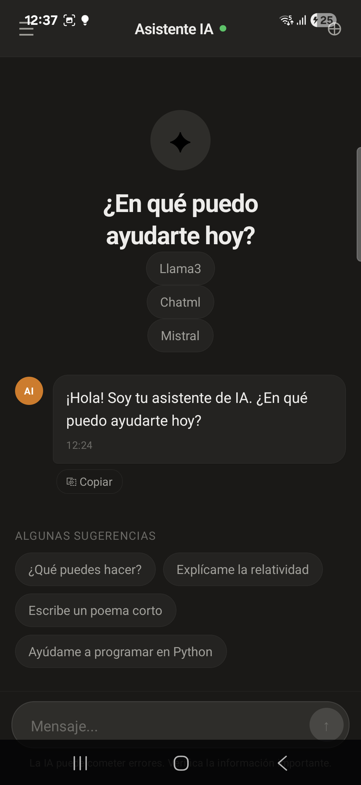

# mobile-rag
React Native + Rag + Chat
=======

# Primera prueba de concepto.

Esta iniciado usando un template de react native.

Luego se agrego una UI simple de chat la cual tiene interaccion 
con un LLM que se puede descargar.

Proximos pasos:
 * agregar sqlite (https://github.com/sqliteai/sqlite-vector) 
 * agregar settings para tomar base de datos y apuntar modelos aprobados
 * probar modelos y fuentes de datos para calificar la respuesta
 * mas documentacion sobre instalacion local, distribucion y como modificar el software

## Para probar en Android

1) Clonar el repositorio (requiere git)
2) Descargar dependencias (require pnpm, gradle, y un SDK de android)
3) Enchufar un telefono por USB en modo Dev activado
4) Iniciar dev (pnpm start) y instalar la app en el telefono (pnpm run android)

## Para probar en iOS

En curso
